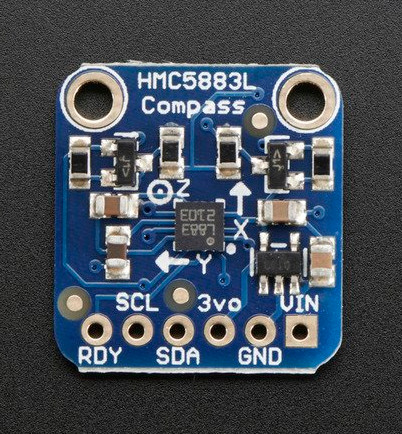

HMC8553L
===========================================

Python wrapper class for HMC5883L magnetometer (using smbus I2c)

| Board pin name | Board pin | Beaglebone Black pin name |
|----------------|-----------| --------------------------|
| RDY            | 1         | Not Used                  |
| SCL            | 2         | P9\_19, I2C2\_CL          |
| SDA            | 3         | P9\_20, I2C_SDA           |
| 3Vo            | 4         | Not Used                  |
| GND            | 5         | P9\_1, Ground             |
| VCC            | 6         | P9\_5, VDD\_5v            |

